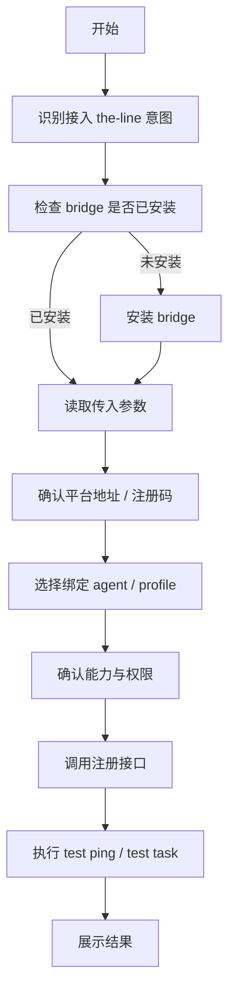

# 《OpenClaw bridge setup wizard 设计》

## 0. 文档定位

本文是 `the-line` 与 OpenClaw bridge 自接入方案中的 **安装向导设计文档**。

它关注的是：

* 用户如何把自己的 OpenClaw 接入 `the-line`
* bridge 安装后，setup wizard 应该如何工作
* 向导应该收集什么信息
* 哪些信息必须问用户，哪些可以自动推断
* 如何让流程尽可能简单，同时又不失稳

本文不是接口协议文档。
接口字段请配合《OpenClaw bridge 接口协议》一起使用。

---

## 1. setup wizard 的目标

### 1.1 为什么需要 wizard

如果只提供一个插件，不提供 setup wizard，会出现这些问题：

* 用户不知道接下来还要配什么
* OpenClaw 不知道平台地址和注册码来自哪里
* 绑定哪个 agent/profile 没有被显式确认
* 用户不知道哪些执行能力会被启用
* 最后即使“安装成功”，也不一定“接入成功”

wizard 的目的就是把这件事变成一个：

* 有步骤
* 可中断
* 可恢复
* 可验证
* 对用户足够友好

的安装向导。

### 1.2 wizard 的设计目标

#### 目标 A：极简

用户应尽量只需要提供：

* 平台地址
* 注册码
* 默认绑定 agent

其他信息能推断则推断。

#### 目标 B：可确认

向导必须让用户明确知道：

* 这次接入的是哪个平台
* 会启用什么能力
* 将默认使用哪个 OpenClaw agent

#### 目标 C：可诊断

失败时不能只说“安装失败”，必须告诉用户：

* 是平台地址错了
* 注册码失效了
* 还是 OpenClaw 当前 agent 不存在

#### 目标 D：可复跑

如果中途失败，用户应能：

* 重新进入 wizard
* 修正错误项
* 继续完成接入

---

## 2. 用户体验目标

### 2.1 理想交互

用户在 `the-line` 平台点击：

* “接入我的 OpenClaw”

平台生成：

* `platform_url`
* `registration_code`
* 一段推荐给 OpenClaw 的接入说明

用户对 OpenClaw 说：

> 安装 the-line bridge，并接入这个平台：`https://the-line.example.com`，注册码：`TL-ABCD-1234`

OpenClaw 随后进入 wizard：

1. 识别接入意图
2. 检查 bridge 是否已安装
3. 如果未安装，则自动安装
4. 启动 setup wizard
5. 最多只问必要问题
6. 完成注册与测试
7. 返回“接入成功”

### 2.2 用户感知原则

从用户感知上，这个 wizard 应该像：

* “OpenClaw 正在帮我接入一个外部平台”

而不是：

* “我正在手工配一个复杂插件”

### 2.3 时间目标

建议目标：

* 3 分钟内完成第一次接入
* 30 秒内给出第一个清晰反馈

---

## 3. wizard 总体结构

### 3.1 向导阶段

建议把 wizard 拆成 7 个阶段：

1. 意图识别与前置检查
2. bridge 安装检查
3. 基础信息确认
4. 本地环境与 agent 绑定确认
5. 权限与能力确认
6. 平台注册
7. 测试与完成页

### 3.2 流程图



---

## 4. wizard 输入来源设计

### 4.1 输入来源分类

wizard 需要的信息主要来自三类来源：

#### 1）用户自然语言输入

例如：

* “接入这个平台”
* “用这个注册码”

#### 2）平台预生成信息

例如：

* `platform_url`
* `registration_code`

#### 3）OpenClaw 本地环境

例如：

* 当前 agent 列表
* 当前 bridge 是否已安装
* 当前 OpenClaw 版本

### 4.2 输入优先级

建议优先级如下：

1. 用户显式提供
2. 平台预生成接入信息
3. 本地默认值
4. wizard 询问

### 4.3 能自动推断的不要问

例如：

* OpenClaw 版本
* bridge 版本
* agent 列表
* 当前机器信息

这些都应该自动读出，而不是问用户。

---

## 5. wizard 字段设计

### 5.1 必填字段

建议首版最少只保留以下必填项：

#### `platform_url`

说明：

* `the-line` 平台地址

来源：

* 用户输入
* 或平台生成的接入说明中解析

校验：

* 必须为合法 HTTPS URL
* 首版建议不允许纯 HTTP

#### `registration_code`

说明：

* 平台生成的一次性注册码

来源：

* 用户输入
* 或接入说明解析

校验：

* 不能为空
* 格式合法

#### `bound_agent_id`

说明：

* 默认绑定哪个 OpenClaw agent / profile

来源：

* 本地 agent 列表中选择

校验：

* 必须存在于本地 OpenClaw agent 列表中

### 5.2 可选字段

#### `display_name`

说明：

* 平台显示该 OpenClaw 实例的名字

默认值：

* `<用户名>'s OpenClaw`
* 或 `<hostname>`

#### `capability_profile`

说明：

* 本实例允许执行哪些能力

默认值：

* `standard`

可选值建议：

* `standard`
* `execute_only`
* `execute_export`

#### `planner_agent_id`

说明：

* 草案生成默认使用哪个 agent

默认值：

* 可与 `bound_agent_id` 一致
* 或由平台注册返回覆盖

---

## 6. wizard 每一步的细化设计

### 6.1 Step 1：意图识别与前置检查

#### 目标

确认用户确实是在做 `the-line` 接入，而不是普通插件安装。

#### 输入

* 用户自然语言
* 可能包含平台地址和注册码

#### 输出

* 进入接入向导

#### 行为建议

如果识别到：

* `the-line`
* `bridge`
* `注册码`
* `接入平台`

这些关键词，应优先进入安装向导模式。

### 6.2 Step 2：bridge 安装检查

#### 目标

确认 `the-line bridge` 是否已安装。

#### 分支

##### 已安装

* 直接进入下一步

##### 未安装

* 询问用户是否允许安装
* 安装完成后进入下一步

#### 安装成功反馈

建议反馈：

* bridge 已安装
* 当前版本号

### 6.3 Step 3：基础信息确认

#### 目标

确认：

* 平台地址
* 注册码

#### UX 建议

如果自然语言中已经包含这两项，直接展示确认，不要再重新提问。

例如：

* 平台地址：`https://the-line.example.com`
* 注册码：`TL-ABCD-1234`

请确认是否使用这组信息继续接入。

### 6.4 Step 4：本地 agent / profile 绑定

#### 目标

确定本次接入默认绑定哪个 OpenClaw agent。

#### UX 建议

优先策略：

1. 如果用户在指令里指定了 agent，则优先使用
2. 否则如果本地只有一个合适 agent，则默认选中
3. 否则展示 2-3 个候选项供选择

#### 选择标准建议

优先选择：

* tools 能力较完整
* 适合执行自动化节点
* 已启用

### 6.5 Step 5：能力与权限确认

#### 目标

让用户确认这次接入后开放哪些能力。

#### 首版建议做成 profile，不要让用户逐项勾太多

例如：

##### `standard`

* 支持草案生成
* 支持自动执行
* 支持导出

##### `execute_only`

* 不支持草案生成
* 只支持自动执行

##### `execute_export`

* 支持执行和导出
* 不做复杂规划

#### 为什么不建议首版搞太细

因为用户很难在安装时准确理解每个 tool group。

首版更适合：

* profile 粗粒度选择
* 后台再精调

### 6.6 Step 6：平台注册

#### 目标

使用已确认信息向 `the-line` 发起注册。

#### 注册前要显示什么

建议向用户展示：

* 平台地址
* 绑定 agent
* 实例显示名

#### 注册失败时要清晰区分原因

例如：

* 注册码无效
* 平台不可达
* bridge 版本过低
* 绑定 agent 不存在

### 6.7 Step 7：测试与完成

#### 目标

确认不是“注册成功但不可用”。

#### 测试建议

至少做两类测试：

##### 测试 A：test ping

验证：

* 平台与 bridge 双向可达

##### 测试 B：test draft 或 test execution

验证：

* OpenClaw runtime 可正常接收一个标准请求并返回结果

#### 完成页建议展示

* 接入成功
* integration id
* 绑定 agent
* bridge 版本
* 最近测试结果

---

## 7. 字段校验规则

### 7.1 `platform_url`

校验建议：

* 必须是 URL
* 首版只接受 `https://`
* 不能带明显非法 path

失败提示建议：

* 平台地址格式不正确
* 当前仅支持 HTTPS 地址

### 7.2 `registration_code`

校验建议：

* 长度符合平台规范
* 允许字母、数字、中划线

失败提示建议：

* 注册码格式不正确
* 注册码已失效或已被使用

### 7.3 `bound_agent_id`

校验建议：

* 必须在本地 agent 列表中存在
* 必须是 active / usable agent

失败提示建议：

* 当前 OpenClaw 中找不到该 agent

---

## 8. 默认值策略

### 8.1 默认值原则

默认值的目标不是偷懒，而是减少提问。

### 8.2 推荐默认值

#### `display_name`

默认：

* `${hostname}'s OpenClaw`

#### `capability_profile`

默认：

* `standard`

#### `bound_agent_id`

默认：

* 如果本地只有一个合适 agent，用它
* 否则优先选工具能力最完整的 agent

---

## 9. 错误处理与恢复设计

### 9.1 错误分类

建议把错误分为四类：

#### A. 用户输入错误

例如：

* 平台地址格式错
* 注册码格式错

#### B. 平台侧错误

例如：

* 注册码过期
* 平台拒绝注册

#### C. 本地环境错误

例如：

* bridge 安装失败
* 找不到可绑定 agent

#### D. 网络错误

例如：

* 无法访问平台

### 9.2 恢复策略

#### 对 A 类错误

* 允许用户直接重填当前项

#### 对 B 类错误

* 终止本次注册
* 明确要求去平台重新生成注册码

#### 对 C 类错误

* 提示修复建议
* 修复后允许重新进入 wizard

#### 对 D 类错误

* 支持稍后重试

### 9.3 向导恢复点

建议至少支持从以下点恢复：

* 已安装 bridge，但未注册
* 已填完信息，但注册失败
* 已注册成功，但测试失败

---

## 10. 安全与确认设计

### 10.1 为什么 wizard 里仍然要有确认步骤

虽然目标是“让龙虾自己完成接入”，但以下动作仍应获得用户明确同意：

* 安装插件
* 写入接入配置
* 向外部平台注册当前实例

### 10.2 建议的确认点

#### 确认点 1：安装 bridge

展示：

* 插件名
* 来源

#### 确认点 2：绑定平台

展示：

* 目标平台地址
* 本次默认 agent

#### 确认点 3：开放能力

展示：

* 本次将允许的能力 profile

### 10.3 不建议让用户确认过多细节

不要在首版让用户逐条确认：

* 每个 tool
* 每个子权限
* 每个内部 capability

这会把简单安装做复杂。

---

## 11. 安装结果页设计

### 11.1 成功结果页

建议展示：

* 接入成功
* 平台名称 / 地址
* integration id
* bridge 版本
* OpenClaw 版本
* 默认绑定 agent
* 最近测试结果

### 11.2 失败结果页

建议展示：

* 哪一步失败
* 错误原因
* 下一步建议

例如：

* 注册码已过期，请回到虾线平台重新生成
* 当前未找到可绑定 agent，请先创建一个执行型 agent
* 无法访问平台地址，请检查网络和地址

---

## 12. UX 文案建议

### 12.1 安装开始

建议文案：

* 我将帮你把当前 OpenClaw 接入到虾线平台。
* 我会先检查 bridge 是否已安装，然后确认平台信息并完成注册。

### 12.2 注册前

建议文案：

* 请确认我要接入的平台和默认绑定的 agent。

### 12.3 注册成功

建议文案：

* 已完成接入。接下来这台 OpenClaw 可以作为虾线中的龙虾执行实例使用。

### 12.4 测试失败

建议文案：

* 注册已经成功，但测试执行没有通过。建议先修复问题后再正式使用。

---

## 13. 非目标

首版 wizard 不建议做：

* 多平台同时接入
* 多租户复杂切换
* 过细粒度的工具权限逐项勾选
* 完全零确认无人值守自动安装

这些可以在后续版本逐步引入。

---

## 14. 推荐的 wizard 输出结构

为了让 wizard 结束后进入后续执行链路，建议最终输出一个标准对象：

```json
{
  "completed": true,
  "integration_id": "oc_int_001",
  "platform_url": "https://the-line.example.com",
  "display_name": "Alice's OpenClaw",
  "bound_agent_id": "video-ops",
  "capability_profile": "standard",
  "bridge_version": "0.1.0",
  "test_result": {
    "ping_ok": true,
    "execution_ok": true
  }
}
```

这个对象既可以用于：

* wizard 完成页展示
* 本地配置持久化
* 失败时恢复向导状态

---

## 15. Handoff 注意事项

给后续 Agent 的注意点：

1. 向导首版重点是简洁和可靠，不要把它做成一堆复杂表单。
2. wizard 收集的信息要和协议文档字段严格对齐。
3. 用户感知上尽量像“我在让 OpenClaw 帮我接入平台”，而不是“我在手工配置插件”。
4. 失败提示一定要能指导下一步，不要只抛 raw error。
5. 能自动推断的信息不要打扰用户。

---

## 16. 下一步推荐

基于本文，后续最适合继续补的实现文档是：

1. OpenClaw bridge 插件目录结构设计
2. setup wizard 状态持久化方案
3. 接入控制台页面与“生成注册码”页面设计

