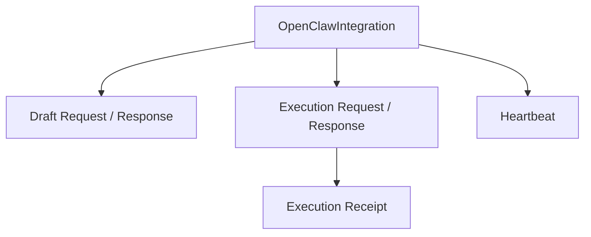

# 《OpenClaw bridge 接口协议》

## 0. 文档定位

本文是《the-line × OpenClaw 自接入与桥接方案》的协议细化文档。

目标是把 `the-line` 与 OpenClaw bridge 之间的交互接口定义为一套 **可实现、可联调、可版本化** 的协议，而不是停留在抽象描述。

本文主要覆盖：

* 注册握手协议
* 心跳协议
* 草案生成协议
* 自动节点执行协议
* 回执协议
* 取消 / 重试 / 健康检查协议
* 版本化和兼容性要求

默认读者：

* `the-line` 后端实现者
* OpenClaw bridge 插件实现者
* 负责联调的后续 Agent

---

## 1. 协议目标

### 1.1 为什么需要单独的协议文档

如果没有单独的协议层，后续实现很容易出现这些问题：

* `the-line` 以为 bridge 会返回某种字段，bridge 实际没返回
* bridge 以为 `the-line` 会推某种状态，`the-line` 实际没有
* 草案生成和自动节点执行的协议风格不一致
* 升级 bridge 版本时，旧版平台无法兼容

因此需要把 bridge 视作一个明确的“系统边界”。

### 1.2 协议设计原则

本文的所有接口都遵循以下原则：

1. `the-line` 是业务流程编排中心
2. OpenClaw bridge 是执行代理，不是流程状态机
3. 所有输入输出都是结构化 JSON
4. 协议版本必须可显式声明
5. 能用显式字段表达的，不依赖自由文本解释
6. 所有外部回调都要可认证
7. 所有执行都要可追踪、可关联、可幂等

---

## 2. 顶层交互模式

### 2.1 交互类型

bridge 与 `the-line` 之间存在两类交互：

#### A. 由 bridge 主动调用 `the-line`

例如：

* 注册
* 心跳
* 回执上报
* 测试结果上报

#### B. 由 `the-line` 主动调用 bridge

例如：

* 草案生成
* 自动节点执行
* 取消执行
* 健康探测

### 2.2 推荐通信方式

建议首版全部走：

* HTTPS JSON API

不要在首版引入：

* gRPC
* 双向长连接作为主控制面
* MQ 作为唯一控制平面

这样做的原因是：

* 易于调试
* 易于落地
* 易于跨语言
* 易于后续前后端以及插件独立开发

### 2.3 顶层资源关系

关键资源如下：

* `OpenClawIntegration`
* `DraftRequest`
* `ExecutionRequest`
* `ExecutionReceipt`
* `Heartbeat`

资源关系可以概括为：



---

## 3. 统一协议约束

### 3.1 Header 约定

所有 bridge 协议建议统一带这些 header：

* `Content-Type: application/json`
* `X-The-Line-Protocol-Version: 1`
* `X-The-Line-Request-Id: <uuid>`
* `X-The-Line-Tenant-Id: <tenant-id>`（如适用）

由 bridge 回调 `the-line` 时，额外带：

* `X-The-Line-Integration-Id: <integration-id>`
* `X-The-Line-Signature: <signature>`

### 3.2 时间格式

所有时间字段统一使用：

* RFC3339 / ISO8601 UTC

例如：

* `2026-04-14T10:00:00Z`

### 3.3 错误格式

所有错误响应建议统一格式：

```json
{
  "ok": false,
  "error": {
    "code": "INVALID_REGISTRATION_CODE",
    "message": "registration code is invalid or expired",
    "retryable": false,
    "details": {}
  }
}
```

### 3.4 成功格式

统一成功返回：

```json
{
  "ok": true,
  "data": {}
}
```

### 3.5 幂等要求

以下接口必须支持幂等：

* 注册（建议基于 registration code + instance fingerprint）
* 草案生成请求
* 自动节点执行请求
* 回执上报
* 取消执行

推荐统一采用：

* `idempotency_key`

---

## 4. OpenClawIntegration 资源定义

### 4.1 资源定位

`OpenClawIntegration` 是 `the-line` 视角下的一个 OpenClaw 实例接入记录。

### 4.2 建议字段

```json
{
  "id": "oc_int_001",
  "tenant_id": "tenant_001",
  "display_name": "Alice's OpenClaw",
  "status": "active",
  "bridge_version": "0.1.0",
  "openclaw_version": "2026.4.14",
  "instance_fingerprint": "ocw_abc123",
  "bound_agent_id": "video-ops",
  "callback_secret": "masked",
  "capabilities": {
    "draft_generation": true,
    "agent_execute": true,
    "agent_export": true
  },
  "last_heartbeat_at": "2026-04-14T10:10:00Z"
}
```

### 4.3 状态建议

可选值建议：

* `pending`
* `active`
* `degraded`
* `disabled`
* `revoked`

---

## 5. 注册握手协议

### 5.1 目标

bridge 安装完成后，通过注册接口向 `the-line` 建立可信接入关系。

### 5.2 接口

#### `POST /api/integrations/openclaw/register`

### 5.3 请求体

```json
{
  "protocol_version": 1,
  "registration_code": "TL-ABCD-1234",
  "bridge_version": "0.1.0",
  "openclaw_version": "2026.4.14",
  "instance_fingerprint": "ocw_abc123",
  "display_name": "Alice's OpenClaw",
  "bound_agent_id": "video-ops",
  "capabilities": {
    "draft_generation": true,
    "agent_execute": true,
    "agent_export": true,
    "supports_lobster": true,
    "supports_async_receipt": true
  },
  "environment": {
    "hostname": "alice-mbp",
    "os": "darwin",
    "arch": "arm64"
  },
  "idempotency_key": "register:ocw_abc123:TL-ABCD-1234"
}
```

### 5.4 字段说明

* `protocol_version`
  * 协议版本号
* `registration_code`
  * 一次性注册码
* `bridge_version`
  * bridge 插件版本
* `openclaw_version`
  * OpenClaw 运行时版本
* `instance_fingerprint`
  * 当前 OpenClaw 实例稳定标识
* `display_name`
  * 便于平台展示的人类可读名称
* `bound_agent_id`
  * 本次接入默认绑定的 OpenClaw agent / profile
* `capabilities`
  * 该实例声明支持的能力
* `environment`
  * 诊断信息
* `idempotency_key`
  * 注册幂等键

### 5.5 响应体

```json
{
  "ok": true,
  "data": {
    "integration_id": "oc_int_001",
    "tenant_id": "tenant_001",
    "status": "active",
    "callback_secret": "cbsec_xxx",
    "heartbeat_interval_seconds": 60,
    "min_supported_bridge_version": "0.1.0",
    "recommended_bridge_version": "0.1.0",
    "executor_profile": {
      "planner_agent_id": "planner-main",
      "default_execute_agent_id": "video-ops"
    },
    "test_ping_required": true
  }
}
```

### 5.6 注册错误码建议

* `INVALID_REGISTRATION_CODE`
* `REGISTRATION_CODE_EXPIRED`
* `REGISTRATION_CODE_ALREADY_USED`
* `BRIDGE_VERSION_TOO_OLD`
* `UNSUPPORTED_PROTOCOL_VERSION`
* `INSTANCE_ALREADY_REGISTERED`

### 5.7 注册幂等行为

当：

* `instance_fingerprint`
* `registration_code`
* `idempotency_key`

一致时，重复调用应返回同一个 `integration_id`。

---

## 6. 心跳协议

### 6.1 目标

让 `the-line` 感知 OpenClaw bridge 当前是否健康。

### 6.2 接口

#### `POST /api/integrations/openclaw/heartbeat`

### 6.3 请求体

```json
{
  "protocol_version": 1,
  "integration_id": "oc_int_001",
  "bridge_version": "0.1.0",
  "openclaw_version": "2026.4.14",
  "status": "healthy",
  "active_runs_count": 2,
  "last_error": null,
  "metrics": {
    "pending_draft_requests": 0,
    "pending_execution_requests": 1
  }
}
```

### 6.4 心跳状态建议

* `healthy`
* `degraded`
* `unavailable`

### 6.5 响应体

```json
{
  "ok": true,
  "data": {
    "accepted": true,
    "server_time": "2026-04-14T10:10:05Z",
    "integration_status": "active",
    "min_supported_bridge_version": "0.1.0",
    "recommended_bridge_version": "0.1.1"
  }
}
```

---

## 7. 草案生成协议

### 7.1 目标

让 `the-line` 能把草案生成请求发给 bridge，再由 bridge 在 OpenClaw 内部完成 planner 执行。

### 7.2 接口

#### `POST /bridge/drafts/generate`

这是 **bridge 暴露给 `the-line`** 的接口。

### 7.3 请求体

```json
{
  "protocol_version": 1,
  "integration_id": "oc_int_001",
  "draft_id": 123,
  "planner_agent_id": "planner-main",
  "session_key": "theline:draft:123",
  "source_prompt": "帮我创建一个视频绑定的工作流程...",
  "constraints": {
    "must_end_with_human_acceptance": true,
    "allowed_node_types": [
      "human_input",
      "human_review",
      "agent_execute",
      "agent_export",
      "human_acceptance"
    ]
  },
  "output_schema_version": "v1",
  "idempotency_key": "draft:123"
}
```

### 7.4 响应体

```json
{
  "ok": true,
  "data": {
    "draft_id": 123,
    "external_session_key": "theline:draft:123",
    "external_run_id": "run_abc123",
    "plan": {
      "title": "视频绑定工作流",
      "description": "用于视频资源绑定和结果签收",
      "nodes": [
        {
          "node_code": "collect_sessions",
          "node_type": "agent_execute",
          "title": "收集待绑定课程场次",
          "execute_actor": {
            "type": "agent",
            "agent_code": "video-ops"
          },
          "result_owner": {
            "type": "person_rule",
            "rule": "initiator"
          },
          "contract": {
            "objective": "收集距离开课不足 2 天的课程场次",
            "expected_output_schema": {
              "type": "object"
            }
          }
        }
      ]
    },
    "summary": "已生成一条 5 节点流程草案"
  }
}
```

### 7.5 草案生成错误码建议

* `PLANNER_AGENT_NOT_FOUND`
* `PLANNER_EXECUTION_FAILED`
* `INVALID_PLAN_OUTPUT`
* `UNSUPPORTED_OUTPUT_SCHEMA_VERSION`

### 7.6 协议约束

bridge 必须保证：

* 返回结构化 `plan`
* 不能直接创建模板
* 不能直接创建 run
* 不能把草案状态改成 `confirmed`

---

## 8. 自动节点执行协议

### 8.1 目标

让 `the-line` 在自动节点 ready 后，能把执行请求发给 bridge。

### 8.2 接口

#### `POST /bridge/executions`

### 8.3 请求体

```json
{
  "protocol_version": 1,
  "integration_id": "oc_int_001",
  "agent_task_id": 2001,
  "run_id": 301,
  "run_node_id": 401,
  "agent_id": 11,
  "agent_code": "video-ops",
  "node_type": "agent_execute",
  "session_key": "theline:run:301:node:401",
  "objective": "将录播课资源绑定到课程场次",
  "input_json": {
    "records": [
      {
        "course_session_id": 1001,
        "video_resource_id": 9001
      }
    ]
  },
  "allowed_tools": ["exec", "browser", "web_fetch"],
  "expected_output_schema": {
    "type": "object",
    "required": ["success_count", "failed_count", "details"]
  },
  "completion_rule": "所有记录处理完成，并输出结构化绑定结果",
  "failure_rule": "当权限不足、数据冲突或副作用风险较高时，停止并返回 blocked",
  "callback": {
    "url": "https://the-line.example.com/api/agent-tasks/2001/receipt",
    "auth_type": "signature",
    "callback_secret_ref": "cbsec_xxx"
  },
  "idempotency_key": "agent_task:2001"
}
```

### 8.4 响应体

```json
{
  "ok": true,
  "data": {
    "accepted": true,
    "agent_task_id": 2001,
    "external_session_key": "theline:run:301:node:401",
    "external_run_id": "run_exec_abc123",
    "status": "running"
  }
}
```

### 8.5 执行接口语义

`POST /bridge/executions` 成功返回只表示：

* bridge 已接受请求
* OpenClaw run 已创建或开始

不表示：

* 节点已完成
* 业务已经成功推进

真正的业务完成由回执驱动。

### 8.6 执行错误码建议

* `EXECUTOR_AGENT_NOT_FOUND`
* `UNSUPPORTED_NODE_TYPE`
* `EXECUTION_ALREADY_RUNNING`
* `INVALID_EXECUTION_CONTRACT`
* `BRIDGE_BUSY`

### 8.7 幂等要求

相同 `idempotency_key` 重复提交时：

* 如果外部 run 已存在，返回相同 `external_run_id`
* 不能启动第二个重复执行

---

## 9. 执行取消协议

### 9.1 目标

允许 `the-line` 在必要时取消一个正在进行的 bridge 执行。

### 9.2 接口

#### `POST /bridge/executions/:agentTaskId/cancel`

### 9.3 请求体

```json
{
  "protocol_version": 1,
  "integration_id": "oc_int_001",
  "agent_task_id": 2001,
  "reason": "operator_cancelled"
}
```

### 9.4 响应体

```json
{
  "ok": true,
  "data": {
    "accepted": true,
    "agent_task_id": 2001,
    "status": "cancelling"
  }
}
```

### 9.5 取消语义

取消请求成功仅表示：

* bridge 已收到取消请求

最终是否取消成功，应通过后续回执体现。

---

## 10. 回执协议

### 10.1 目标

bridge 把 OpenClaw 执行结果标准化回传给 `the-line`。

### 10.2 接口

#### `POST /api/agent-tasks/:taskId/receipt`

这是 **`the-line` 暴露给 bridge** 的接口。

### 10.3 请求体

```json
{
  "protocol_version": 1,
  "integration_id": "oc_int_001",
  "agent_id": 11,
  "status": "completed",
  "started_at": "2026-04-14T10:00:00Z",
  "finished_at": "2026-04-14T10:00:05Z",
  "summary": "已完成视频绑定，共处理 12 条记录，成功 11 条",
  "result": {
    "success_count": 11,
    "failed_count": 1,
    "details": [
      {
        "course_session_id": 1001,
        "status": "success"
      }
    ]
  },
  "artifacts": [
    {
      "name": "binding-report.xlsx",
      "url": "https://bridge.example.com/artifacts/report.xlsx",
      "type": "file"
    }
  ],
  "logs": [
    "step1: load candidate sessions",
    "step2: validate mapping",
    "step3: execute binding"
  ],
  "error_message": ""
}
```

### 10.4 回执状态

允许值建议：

* `completed`
* `needs_review`
* `failed`
* `blocked`
* `cancelled`

### 10.5 回执状态语义

#### `completed`

表示：

* bridge 认为该执行已经达到完成条件

#### `needs_review`

表示：

* bridge 完成了动作
* 但结果必须由人工审核后才能推进

#### `blocked`

表示：

* 执行遇到风险点
* OpenClaw 不应继续自动推进
* 需要人工接管或确认

#### `failed`

表示：

* 执行未完成，且发生错误

#### `cancelled`

表示：

* 执行被取消

### 10.6 回执响应

```json
{
  "ok": true,
  "data": {
    "accepted": true,
    "task_id": 2001
  }
}
```

### 10.7 回执认证

建议 bridge 调用回执接口时：

* 使用 `integration_id`
* 使用 `X-The-Line-Signature`
* 签名原文建议包含：
  * timestamp
  * path
  * raw body

---

## 11. 健康检查协议

### 11.1 目标

让 `the-line` 在需要时主动探测 bridge 是否存活。

### 11.2 接口

#### `GET /bridge/health`

### 11.3 响应体

```json
{
  "ok": true,
  "data": {
    "status": "healthy",
    "bridge_version": "0.1.0",
    "openclaw_version": "2026.4.14",
    "supports_protocol_version": 1,
    "last_ready_at": "2026-04-14T10:09:59Z"
  }
}
```

---

## 12. 测试握手协议

### 12.1 目标

注册完成后，平台可触发一次测试，以验证 bridge 的基本可用性。

### 12.2 接口

#### `POST /bridge/test-ping`

### 12.3 请求体

```json
{
  "protocol_version": 1,
  "integration_id": "oc_int_001",
  "ping_id": "ping_001",
  "kind": "handshake_validation"
}
```

### 12.4 响应体

```json
{
  "ok": true,
  "data": {
    "pong": true,
    "ping_id": "ping_001",
    "bridge_version": "0.1.0"
  }
}
```

---

## 13. 版本化策略

### 13.1 协议版本号

建议所有请求带：

* `protocol_version`

首版定义：

* `1`

### 13.2 兼容策略

#### 向后兼容原则

在 `v1` 内：

* 可新增可选字段
* 不应删除必填字段
* 不应改变现有字段语义

#### 大版本升级原则

若出现以下情况，应升级协议大版本：

* 必填字段变化
* 状态语义变化
* 执行契约结构变化
* 认证方式变化

### 13.3 bridge 版本与协议版本的关系

注意：

* `bridge_version` != `protocol_version`

例如：

* bridge `0.1.3`
* protocol `1`

bridge 版本用于软件升级与兼容治理，协议版本用于接口解释。

---

## 14. 状态映射建议

### 14.1 OpenClaw 到 the-line

| OpenClaw 运行结果 | bridge 回执状态 | the-line 后续含义 |
| --- | --- | --- |
| succeeded | completed | 节点完成 |
| succeeded + blocked outcome | blocked | 节点需人工接住 |
| succeeded + review required | needs_review | 节点进入审核 |
| failed | failed | 节点失败 |
| timed_out | failed | 节点失败 |
| cancelled | cancelled | 节点取消 |
| lost | failed | 视为失败 |

### 14.2 重要说明

bridge 不负责决定：

* 是否直接推进到下一节点
* 是否触发人工审核节点
* 是否终止流程

这些都由 `the-line` 的回执处理逻辑完成。

---

## 15. 推荐的外部标识字段

为了便于排障和可观测，建议 `the-line` 的 `AgentTask` 最终保存以下信息：

* `external_runtime = "openclaw"`
* `external_session_key`
* `external_run_id`
* `external_task_id`（可选）
* `executor_meta_json`

这些字段虽然不是协议本身的一部分，但强烈建议与协议一并设计。

---

## 16. 错误恢复与重试建议

### 16.1 可重试错误

建议以下错误标记为 `retryable=true`：

* `BRIDGE_BUSY`
* `NETWORK_TIMEOUT`
* `TEMPORARY_UNAVAILABLE`

### 16.2 不可重试错误

建议以下错误标记为 `retryable=false`：

* `INVALID_REGISTRATION_CODE`
* `UNSUPPORTED_PROTOCOL_VERSION`
* `INVALID_EXECUTION_CONTRACT`
* `EXECUTOR_AGENT_NOT_FOUND`

### 16.3 回执重试

bridge 在回执上报失败时，建议：

* 按指数退避重试
* 保证相同回执体幂等

---

## 17. Handoff 注意事项

给后续 Agent 的几个注意点：

1. 首版先把协议稳定下来，不要一开始就加太多可选分支。
2. 所有执行接口都要保留 `idempotency_key`。
3. 回执状态里的 `blocked` 不要删，它是产品闭环的关键。
4. 不要让 bridge 自己改 `the-line` 流程状态，只提交回执。
5. `chat.send + agent.wait` 是当前最自然的执行模型，不建议首版绕到别的面上。

---

## 18. 下一步推荐

在本文基础上，后续最适合继续推进的实现文档是：

1. `the-line` 后端 integration 数据模型与接口设计
2. OpenClaw bridge 插件目录结构与模块设计
3. `OpenClawPlannerExecutor` / `OpenClawTaskExecutor` 代码级实现说明

