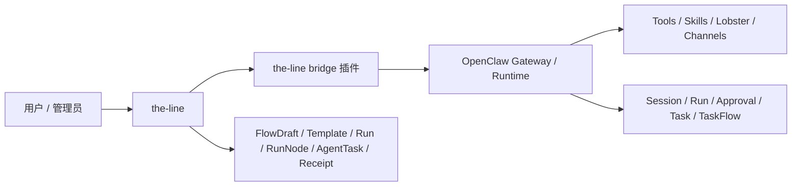

# 《the-line × OpenClaw 自接入与桥接方案》

## 0. 文档定位

本文是一份面向后续 Agent / 工程实现者的 **handoff 级方案文档**。

目标不是只描述一个抽象方向，而是把以下内容一次性说清楚：

* 为什么要做 “OpenClaw 自接入”
* 当前 `the-line` 与 `openclaw` 的代码和产品边界分别是什么
* 为什么最终方案不应该是“发一篇自由文本给龙虾自己理解并接入”
* 为什么更推荐“插件桥 + setup wizard + 注册握手 + 标准回执协议”
* 最终期望的用户体验应该长什么样
* 这套方案拆成哪些模块，后续实现时分别落在哪一边
* 第一阶段、第二阶段、第三阶段分别该怎么做
* 哪些是必须保持的设计原则，后续实现时不要跑偏

本文默认读者已经知道：

* `the-line` 是“流程编排 + 责任闭环平台”
* `openclaw` 是“龙虾执行运行时 / 网关 / session / tool / approval runtime”

如果只看一句话，请记住：

**`the-line` 负责流程和责任，`openclaw` 负责执行，二者之间通过一个可安装的 bridge 插件稳定衔接。**

---

## 1. 背景与问题定义

### 1.1 当前产品方向

`the-line` 当前已经明确了龙虾集成的产品主张：

* 发起人可以用自然语言让龙虾生成流程草案
* 自动节点流转到龙虾时，龙虾要被真实触发执行
* 龙虾执行结束后，要把结果通过标准回执协议回传给 `the-line`
* `the-line` 决定节点状态如何推进、是否进入人工确认、是否进入异常接管
* 整个产品的核心理念是：

**龙虾负责执行，人负责结果。**

这意味着：

* `the-line` 不是一个通用 Agent 平台
* `the-line` 的核心价值不是“让 AI 干活”
* `the-line` 的核心价值是“让 AI 干的活，能被人接住、确认、签收、负责”

### 1.2 当前技术现状

从当前仓库状态看：

#### `the-line` 侧

`the-line` 已经具备这些能力：

* 流程草案 `FlowDraft`
* 自动节点任务 `AgentTask`
* 回执对象 `AgentTaskReceipt`
* 结果责任人字段
* `AgentExecutor` / `AgentPlannerExecutor` 扩展点
* Mock planner / mock executor
* 回执驱动的流程流转

这说明 `the-line` 这边已经把“真实龙虾接入点”预留出来了。

#### `openclaw` 侧

从仓库与官方文档能力看，`openclaw` 已经具备：

* 插件机制
* channel plugin 机制
* tool / hook / service 扩展能力
* gateway RPC
* session 与 chat runtime
* `chat.send` / `agent.wait`
* tool events / agent events
* exec approval
* background tasks / taskflow
* webhook-style integration能力
* 安装插件、运行 wizard、自举 onboarding 的基础设施

这说明 `openclaw` 不是一个“只能接一段 prompt 的模型壳子”，而是一个成熟的运行时系统。

### 1.3 本文要解决的问题

用户提出的核心诉求是：

> 能不能最终形成一个非常简单的安装流程，比如某个人想把自己的 OpenClaw 接入该平台的时候，直接发送一个操作手册或者文档给自己的 OpenClaw，然后龙虾就可以自行接入了。

这个诉求要拆成两个层面：

#### 层面 A：用户体验

用户希望：

* 不需要手工看一堆技术文档
* 不需要理解复杂 API
* 不需要自己拼接配置文件
* 最好只需要给 OpenClaw 一句命令或一份安装说明
* OpenClaw 自己完成安装、配置、握手和验证

#### 层面 B：系统设计

系统必须保证：

* 接入过程稳定、可重复、可验证
* 不能让 OpenClaw 直接接管 `the-line` 的流程状态
* 不能因为接入方式过于自由，导致不同实例行为不一致
* 不能依赖“AI 临场理解一篇自然语言文档后自由发挥”

---

## 2. 结论先行

### 2.1 结论

**可以实现“用户给自己的 OpenClaw 一句安装说明，OpenClaw 自己完成接入”。**

但这个目标的正确实现方式不是：

* 发一篇 PRD 给龙虾自由理解
* 让龙虾凭 prompt 现场判断应该改哪些配置
* 让龙虾直接猜测怎么和 `the-line` 完成握手

而应该是：

**做一个 `the-line bridge` 插件 / 接入包，让 OpenClaw 按标准安装和 setup 流程执行。**

### 2.2 最终建议方案

推荐最终落地为：

#### 一套可发布的 OpenClaw 插件

例如：

* `@the-line/openclaw-bridge`
* 或 `@your-org/openclaw-the-line`

#### 一套标准 setup wizard

由插件安装后自动执行，用来收集最少必要信息。

#### 一套 one-time registration code 机制

由 `the-line` 生成注册码，OpenClaw 安装时使用。

#### 一套 bridge 协议

用于：

* 流程草案生成
* 自动节点执行
* 回执回传
* 健康检查
* 取消 / 超时 / 异常映射

#### 一套极简用户操作方式

用户可以对自己的 OpenClaw 说：

> 安装 the-line bridge，并接入这个平台：`https://the-line.example.com`，注册码：`TL-XXXX-XXXX`

随后 OpenClaw：

1. 安装插件
2. 跑 setup
3. 请求必要确认
4. 向 `the-line` 完成注册握手
5. 做一次测试调用
6. 返回“接入成功”

---

## 3. 为什么不是“纯文档驱动接入”

### 3.1 纯 prompt / 纯文档方式的直觉很诱人

从产品感受上，“发一份手册给龙虾，它自己看完后接入系统”很自然，也很酷。

但如果直接按这个方向做，后面会遇到几个结构性问题。

### 3.2 问题一：不可重复

如果接入逻辑只是：

* 看文档
* 理解文档
* 自己决定具体操作

那么不同 OpenClaw 版本、不同模型、不同上下文状态下，行为会不一致。

结果会出现：

* 这次能接上，下次接不上
* A 的龙虾会这样装，B 的龙虾会那样装
* 无法形成标准化安装体验

### 3.3 问题二：不可验证

纯自然语言安装很难回答这些问题：

* 是否真的写入了正确配置
* 是否真的完成注册
* 是否真的和 `the-line` 建立了桥
* 是否只是“看起来像接上了”

工程上必须有一个可验证的安装结果。

### 3.4 问题三：不可升级

后面 bridge 升级时，如果基础接入逻辑是 prompt-based：

* 版本兼容性很难管
* 用户无法知道自己当前接入的桥版本是什么
* 无法做 migration
* 无法做最小升级路径

### 3.5 问题四：安全边界不清

接入过程往往会涉及：

* token / registration code
* callback secret
* 外部平台地址
* 允许哪些工具
* 哪些执行结果可以回传

这些东西不适合靠自由文本推理临场拼装。

### 3.6 正确理解“给 OpenClaw 一份手册”

最终体验仍然可以保留“给 OpenClaw 一份说明，它自己完成接入”。

但这份“说明”的本质不应该只是文本，而应该是：

* 一个标准安装指令
* 一个版本化插件
* 一个 setup playbook
* 一个固定的握手协议

也就是说：

**用户感知上像“发给龙虾一份说明就行”，系统实现上其实是“龙虾执行标准化安装剧本”。**

---

## 4. 调研结论与外部上下文

### 4.1 对 OpenClaw 现有扩展机制的判断

结合当前 `openclaw` 仓库与公开文档，可以归纳出几个重要结论：

#### 1）OpenClaw 官方扩展主路径是插件，不是 ad-hoc prompt

OpenClaw 已经明确提供：

* plugin 机制
* channel plugin 机制
* tool 扩展
* runtime hook
* gateway method / HTTP / WS 交互

这说明如果我们想让 OpenClaw “学会接入 the-line”，最自然的方式是交付一个插件，而不是只交付文档。

#### 2）OpenClaw 已有稳定的 runtime 调用面

`openclaw` 已经内建：

* `chat.send`
* `agent.wait`
* session 管理
* tool event / agent event
* task / taskflow

这意味着：

* `the-line` 不应该自己设计一套独立的 OpenClaw 执行协议并绕开这些基础设施
* 更应该复用 OpenClaw 现有的 session-run-wait 模式

#### 3）OpenClaw 的 webhook / taskflow 很强，但不适合拿来替代 `the-line` 的主流程状态机

OpenClaw 的 taskflow 本质上是 OpenClaw 自己的 durable flow substrate。

如果直接让 `the-line` 把自己的流程主链路托管给 OpenClaw taskflow，就会出现：

* `the-line` 有一套节点状态机
* OpenClaw taskflow 又有一套 flow 状态机

这会导致双编排中心，不利于产品边界清晰。

#### 4）Lobster 更适合做“节点内部的确定性执行流程”，不适合做“the-line 外层流程编排”

Lobster 非常适合：

* 一个自动节点内部需要多步 tool sequence
* 需要 explicit approvals
* 需要可恢复的确定性 pipeline

但 `the-line` 的外层流程里还有：

* 责任人
* 结果责任人
* 人工审核
* 最终签收

这层必须由 `the-line` 负责。

### 4.2 因此调研后的最终判断

最佳方案不是：

* “把 `the-line` 做成一个 OpenClaw channel”
* “把 `the-line` 的流程状态完全托管给 OpenClaw taskflow”
* “让 OpenClaw 直接写 `the-line` 数据库”
* “让 OpenClaw 靠看一篇文档直接临场接入”

最佳方案是：

**`the-line` 保持唯一流程编排器，OpenClaw 通过桥接插件接入，作为可安装、可注册、可验证、可升级的真实龙虾运行时。**

---

## 5. 顶层设计原则

后续不管谁继续实现，都建议不要打破以下原则。

### 5.1 单一编排中心原则

**只有 `the-line` 能推进业务流程状态。**

OpenClaw 只能：

* 生成草案建议
* 执行自动节点
* 回传执行结果
* 回传运行中状态 / 日志 / 产物

不能：

* 直接改 `Run` 状态
* 直接改 `RunNode` 状态
* 直接把流程推进到下一节点

### 5.2 OpenClaw 是执行运行时，不是业务责任系统

OpenClaw 的职责是：

* 执行
* 工具调用
* 会话管理
* 批处理
* 审批门控
* 长任务运行

`the-line` 的职责是：

* 流程定义
* 节点责任
* 结果责任
* 人工确认
* 审计与交付

### 5.3 用户极简体验原则

最终接入体验要尽量接近：

* 用户只需要一条安装指令
* 或只需要一个注册码 + 平台地址

其他复杂性都应该被收敛到插件和 wizard 里。

### 5.4 协议优先原则

所有跨系统交互都必须是结构化协议，不要依赖自由文本约定。

包括：

* 草案生成输入
* 草案生成输出
* 自动节点执行输入
* 执行结果回执
* 健康检查
* 注册握手

### 5.5 可升级原则

bridge 方案从一开始就要考虑：

* 版本号
* backward compatibility
* migration
* feature flag

否则后面会非常难维护。

---

## 6. 最终目标产品体验

### 6.1 用户故事

一个业务方已经有自己的 OpenClaw，希望把它接入 `the-line`。

他在 `the-line` 上点击：

* “接入我的 OpenClaw”

平台生成：

* 平台地址
* 一次性注册码
* 推荐安装指令

用户对自己的 OpenClaw 说：

> 安装 the-line bridge，并接入这个平台：`https://the-line.example.com`，注册码：`TL-ABCD-1234`

OpenClaw 执行后：

1. 安装 bridge 插件
2. 读取 bridge manifest
3. 跑 setup wizard
4. 请求用户确认敏感权限
5. 调用 `the-line` 注册接口
6. 获取 agent binding / executor profile
7. 做一次 test handshake
8. 返回：
   * 已接入成功
   * 当前绑定的 agent 是谁
   * 当前 bridge 版本是多少

在 `the-line` 后台可以看到：

* 该 OpenClaw 实例
* 实例状态 healthy / degraded
* 最近心跳
* 绑定的 agent
* 支持的执行能力

### 6.2 用户体验约束

这套流程应该尽量满足：

* 3 分钟内完成第一次接入
* 接入后可以立即跑一个测试任务
* 失败时错误能被清晰解释
* 升级 bridge 时不需要用户重新理解架构

---

## 7. 总体架构

### 7.1 架构图



### 7.2 边界划分

#### `the-line` 负责

* 流程草案保存
* 模板保存
* 流程实例
* 节点状态机
* 人工审核
* 最终签收
* 结果责任
* AgentTask 任务记录
* AgentTaskReceipt 回执记录
* 平台内展示与审计

#### OpenClaw bridge 负责

* 安装时 setup
* 向 `the-line` 注册当前 OpenClaw 实例
* 承接来自 `the-line` 的执行请求
* 映射到 OpenClaw session / run
* 采集结果 / 日志 / 产物
* 转换为 `the-line` 可消费的回执
* 上报健康状态

#### OpenClaw runtime 负责

* 真正跑模型 / tool / skill / lobster
* 会话隔离
* 审批 / 安全门控
* 后台任务
* execution logs / artifacts

---

## 8. 方案核心：the-line bridge 插件

### 8.1 插件定位

`the-line bridge` 不是一个 channel plugin。

它更像一个：

* runtime bridge
* external platform connector
* setup-capable integration plugin

### 8.2 插件职责

bridge 插件至少负责以下 6 件事：

#### 1）安装与 setup

安装后引导用户完成接入配置。

#### 2）实例注册

向 `the-line` 声明：

* 我是谁
* 我支持什么能力
* 我当前用哪个 agent/profile
* 我的 bridge 版本是什么

#### 3）草案生成代理

当 `the-line` 需要 `GenerateDraft` 时，bridge 负责把请求送进 OpenClaw planner session。

#### 4）自动节点执行代理

当 `the-line` 需要 `Execute` 时，bridge 负责：

* 建 session
* 发 chat / task
* 等待结果
* 规范化输出

#### 5）回执转换

bridge 把 OpenClaw 的 run / task / event 转换成 `the-line` 的 `AgentReceiptRequest`。

#### 6）健康检查和诊断

bridge 要能告诉 `the-line`：

* 是否在线
* 是否可执行
* 最近是否报错
* 是否版本过低

### 8.3 插件不负责什么

bridge 插件不负责：

* 业务流程编排
* 平台内节点责任归属
* 人工审核逻辑
* 最终交付签收逻辑

这些都必须留在 `the-line`。

---

## 9. 接入模式设计

### 9.1 模式选择

推荐使用：

**插件桥模式（主方案）**

而不是：

* 纯 webhook 编排模式
* channel 模式
* 数据库直连模式
* prompt-only 自接入模式

### 9.2 为什么主链路不用 OpenClaw taskflow 承载 the-line 流程

OpenClaw taskflow 很强，但它更适合：

* OpenClaw 自己内部的 durable automation
* detached multi-step task sequencing

而 `the-line` 的流程主链路除了顺序关系外，还有：

* 责任人
* 结果责任人
* 节点审核
* 结果签收

这些是 `the-line` 的主场，不应该让 OpenClaw 成为主状态源。

### 9.3 为什么主链路不优先走 `/tools/invoke`

OpenClaw 的 `/tools/invoke` 更适合“窄自动化工具调用”，不是完整 session orchestration 主通道。

它有几个限制：

* 某些 session / orchestration 级能力默认不能经由这个面直接用
* 更适合单次 tool invoke
* 不适合完整承接长期 session-run-wait 语义

因此更适合 `the-line` 的，是 OpenClaw 已有的 session-oriented 运行方式：

* `chat.send`
* `agent.wait`
* 必要时结合事件订阅

### 9.4 推荐调用模型

#### 草案生成

`the-line`  
-> `OpenClawPlannerExecutor`  
-> bridge  
-> OpenClaw planner session  
-> 结构化草案  
-> `the-line` 校验并保存

#### 自动节点执行

`the-line`  
-> `OpenClawTaskExecutor`  
-> bridge  
-> OpenClaw node session  
-> OpenClaw 执行  
-> bridge 规范化回执  
-> `the-line` `ProcessReceipt`

---

## 10. 安装与自接入设计

### 10.1 总体目标

把复杂安装过程包装成：

* 一条对 OpenClaw 可执行的安装指令
* 一个版本化插件
* 一个 setup wizard

### 10.2 最终推荐流程

#### Step 1：用户在 `the-line` 上生成接入信息

`the-line` 提供页面：

* 接入 OpenClaw

点击后生成：

* `platform_url`
* `registration_code`
* 推荐安装指令
* 可选的接入说明文本

#### Step 2：用户把安装指令交给自己的 OpenClaw

例如：

> 安装 `@the-line/openclaw-bridge`，并用下面的信息接入：  
> `platform_url=https://the-line.example.com`  
> `registration_code=TL-ABCD-1234`

#### Step 3：OpenClaw 安装插件

bridge 插件安装方式支持：

* marketplace
* npm package
* Git URL
* 本地 path

建议优先 marketplace / npm。

#### Step 4：bridge 启动 setup wizard

wizard 需要收集最少必要信息：

* `platform_url`
* `registration_code`
* 当前要绑定哪个 OpenClaw agent / profile
* 是否允许自动节点调用哪些工具组
* 是否允许导出类任务
* 是否允许批量操作类任务

#### Step 5：bridge 向 `the-line` 发起注册

调用 `the-line` 的注册接口，完成 handshake。

#### Step 6：`the-line` 返回绑定配置

例如：

* `integration_id`
* `agent_binding_id`
* `heartbeat_interval`
* `capability_profile`
* `callback_secret`
* `min_bridge_version`

#### Step 7：bridge 完成本地配置写入

包括：

* 保存 bridge 配置
* 保存 integration id
* 保存 callback secret
* 保存 capability profile

#### Step 8：bridge 发起 test ping

验证：

* 注册成功
* 回调成功
* 当前 OpenClaw 能正常执行一个测试任务

#### Step 9：平台显示 connected

`the-line` 后台显示：

* 该 OpenClaw 已接入
* 绑定的 agent
* 最近心跳
* 状态 healthy

### 10.3 让“发文档给龙虾”这件事真正成立

从用户视角，仍然可以提供一段更自然的操作说明：

> 这是虾线平台给你的接入包，请帮我安装并接入。  
> 平台地址：...  
> 注册码：...

但底层要确保这段说明最终会触发：

* 标准插件安装
* 标准 wizard
* 标准握手
* 标准验证

而不是依赖自由理解。

---

## 11. 注册握手设计

### 11.1 为什么需要注册握手

注册握手的目的是让 `the-line` 能明确知道：

* 这是哪个 OpenClaw 实例
* 它当前绑定的是哪个 agent
* 它支持哪些执行能力
* 它用的是哪个 bridge 版本
* 它应该如何被平台调用

### 11.2 注册接口建议

#### `POST /api/integrations/openclaw/register`

请求体建议包含：

```json
{
  "registration_code": "TL-ABCD-1234",
  "bridge_version": "0.1.0",
  "openclaw_version": "x.y.z",
  "instance_fingerprint": "ocw_xxx",
  "display_name": "Alice's OpenClaw",
  "bound_agent_id": "video-ops",
  "capabilities": {
    "draft_generation": true,
    "agent_execute": true,
    "agent_export": true,
    "human_review_assist": false
  }
}
```

返回体建议包含：

```json
{
  "integration_id": "oc_int_001",
  "tenant_id": "tenant_001",
  "agent_binding_id": "binding_001",
  "callback_secret": "xxx",
  "heartbeat_interval_seconds": 60,
  "min_bridge_version": "0.1.0",
  "executor_profile": {
    "planner_agent_id": "planner-main",
    "default_execute_agent_id": "video-ops"
  }
}
```

### 11.3 注册码机制

注册码建议：

* 一次性
* 短时有效
* 绑定租户 / workspace
* 可作废

这样可以避免：

* 任意 OpenClaw 实例误接入
* 历史码重复利用

### 11.4 心跳机制

bridge 注册成功后，建议按固定间隔上报：

#### `POST /api/integrations/openclaw/heartbeat`

内容包含：

* integration id
* bridge version
* openclaw version
* current health
* active runs count
* last error summary

---

## 12. 草案生成桥接设计

### 12.1 目标

让 `the-line` 的 `GenerateDraft` 能从 mock 切到真实 OpenClaw。

### 12.2 调用链

`FlowDraftService`
-> `OpenClawPlannerExecutor.GenerateDraft`
-> bridge
-> OpenClaw planner session
-> structured output
-> `DraftPlan`

### 12.3 session key 规范

建议：

* `theline:draft:<draftId>`

优势：

* 草案上下文隔离
* 同一草案重试不会串历史任务
* 后续可追踪

### 12.4 planner 输入格式

不要只传一段裸 prompt。

建议传结构化 planner request：

```json
{
  "request_type": "draft_generation",
  "draft_id": 123,
  "source_prompt": "帮我创建一个视频绑定工作流程...",
  "constraints": {
    "must_end_with_human_acceptance": true,
    "allowed_node_types": [
      "human_input",
      "human_review",
      "agent_execute",
      "agent_export",
      "human_acceptance"
    ]
  },
  "output_schema_version": "v1"
}
```

### 12.5 planner 输出格式

bridge 必须把 OpenClaw 结果规整成 `DraftPlan`，包括：

* title
* description
* nodes
* 节点类型
* 执行主体
* 结果责任人建议
* 输入输出契约

### 12.6 关键原则

OpenClaw 只生成：

* 草案建议

不能直接：

* 创建模板
* 创建流程实例
* 让流程生效

确认创建模板这一步，必须还在 `the-line`。

---

## 13. 自动节点执行桥接设计

### 13.1 目标

让 `the-line` 自动节点流转到龙虾时，真正跑 OpenClaw 执行。

### 13.2 调用链

`RunOrchestrationService.DispatchIfNeeded`
-> `AgentTaskService.CreateAndDispatch`
-> `OpenClawTaskExecutor.Execute`
-> bridge
-> OpenClaw session run
-> `agent.wait`
-> 规范化回执
-> `AgentTaskService.ProcessReceipt`

### 13.3 session key 规范

建议每个自动节点一个独立 session：

* `theline:run:<runId>:node:<nodeId>`

这样做的好处：

* 节点上下文不串
* 日志容易追踪
* 重试时可控
* 可按节点查看执行历史

### 13.4 run / idempotency 规范

建议：

* `the-line AgentTask.ID` 作为外部幂等键
* 保存 `external_run_id`
* 保存 `external_session_key`

如果一个节点重试，则生成新 `AgentTask`，但复用相同 session key 或加 retry suffix，按实际需要确定。

### 13.5 执行请求格式

自动节点发给 bridge 的内容必须是“执行契约”，不能只是自然语言。

建议结构如下：

```json
{
  "task_id": 2001,
  "run_id": 301,
  "run_node_id": 401,
  "agent_code": "video-ops",
  "node_type": "agent_execute",
  "objective": "将录播课资源绑定到待开课课程场次",
  "input_json": {
    "records": [
      { "course_session_id": 1001, "video_resource_id": 9001 }
    ]
  },
  "allowed_tools": ["exec", "browser", "web_fetch"],
  "expected_output_schema": {
    "type": "object",
    "required": ["success_count", "failed_count", "details"]
  },
  "completion_rule": "所有可绑定的记录都被处理，并输出结构化结果",
  "failure_rule": "当出现权限不足、数据不一致或批量副作用风险时停止并标记 blocked"
}
```

### 13.6 OpenClaw 内部执行方式

OpenClaw 内部可以有多种实现：

#### 方案 A：普通 agent run

直接使用 `chat.send` + `agent.wait`。

#### 方案 B：Lobster 驱动的节点内部确定性流程

如果一个节点内部实际上是：

* 查询
* 过滤
* 校验
* 执行
* 导出

那么非常适合在 OpenClaw 内部用 Lobster 跑。

但请注意：

* Lobster 只负责 **节点内部执行**
* 不能上升为 `the-line` 外层流程状态机

### 13.7 为什么优先推荐 `chat.send + agent.wait`

这是 OpenClaw 现有成熟能力：

* 有 session 概念
* 有 run id
* 有等待机制
* 可追踪
* 和 agent runtime 一致

相比之下，`/tools/invoke` 更适合作为窄工具面，而不是主链路。

---

## 14. 回执与状态映射设计

### 14.1 原则

OpenClaw 的结果必须被 bridge 规范化为 `the-line` 能消费的回执。

### 14.2 `the-line` 回执仍然是主协议

bridge 最终应向 `the-line` 提交：

* `agent_id`
* `status`
* `started_at`
* `finished_at`
* `summary`
* `result`
* `artifacts`
* `logs`
* `error_message`

### 14.3 推荐状态映射

| OpenClaw 状态 | the-line AgentTask 状态 | 说明 |
| --- | --- | --- |
| `succeeded` | `completed` | 明确完成 |
| `succeeded + blocked outcome` | `blocked` / `needs_review` | 执行停在待人工接住 |
| `failed` | `failed` | 执行失败 |
| `timed_out` | `failed` | 暂时统一映射到失败 |
| `cancelled` | `cancelled` | 任务被取消 |
| `lost` | `failed` | 运行时丢失，平台视作失败 |

### 14.4 `blocked` 语义很重要

这是本方案里非常关键的点。

因为很多真实业务场景里，龙虾不是“成功”或“失败”二元状态，而是：

* 我已经执行到某一步
* 我发现这里需要人工确认
* 我不能继续自动推进

这时：

* OpenClaw 可以内部标记 `blocked`
* bridge 把它转成 `the-line` 的 `needs_review` 或 `blocked`
* `the-line` 进入人工审核或接管节点

这非常符合产品主张：

* 龙虾负责执行
* 人负责接住结果

### 14.5 日志与产物

建议 bridge 尽量回传：

* 简短摘要
* 结构化结果
* 原始日志摘要
* 产物链接
* 必要时保留原始 OpenClaw run reference

这样 `the-line` 前端工作台才能真正展示“龙虾做了什么”。

---

## 15. OpenClaw 与 the-line 的数据映射建议

### 15.1 `the-line Agent` 与 OpenClaw agent/profile 的关系

`the-line` 里的 Agent 不一定等于 OpenClaw 的某个单一 model。

更合理的是：

* `the-line Agent` -> 一个 OpenClaw runtime profile / agent binding

例如：

* `shift_class_agent`
* `video_ops_agent`
* `export_agent`

在 OpenClaw 里各自对应：

* 不同 tools allowlist
* 不同默认模型
* 不同 skill 集
* 不同审批策略

### 15.2 `AgentTask` 与 OpenClaw run/task 的关系

建议不是强绑定到 OpenClaw 内部 taskflow id，而是桥接层保存外部引用：

* `external_runtime = "openclaw"`
* `external_session_key`
* `external_run_id`
* `external_task_id`（如需要）
* `executor_meta_json`

这样后续：

* 排障方便
* UI 能跳转
* 日志能对上

### 15.3 推荐新增字段

后续如果进入真实接入实现，建议在 `the-line AgentTask` 里追加：

* `ExternalRuntime`
* `ExternalSessionKey`
* `ExternalRunID`
* `ExternalTaskID`
* `ExecutorMetaJSON`

---

## 16. 安全与审批设计

### 16.1 业务审批和 OpenClaw exec approval 不是一回事

必须明确：

* OpenClaw 的 approval 主要是 tool / exec 安全门
* `the-line` 的人工审核 / 签收是业务责任门

两者可以配合，但不能混淆。

### 16.2 不建议把业务审核建立在 OpenClaw 原生 chat approval 上

原因：

* chat approval 更偏执行安全
* 后台模式下交互式审批不一定稳定
* 它不等价于 `the-line` 的“结果责任确认”

所以推荐：

* OpenClaw 内部 approval 只做执行安全门
* `the-line` 审核 / 签收继续走自己的节点状态机

### 16.3 最小权限原则

bridge 不应给 OpenClaw 放开无限能力。

应根据 agent binding / capability profile 限定：

* 哪些工具能用
* 哪些节点类型能执行
* 哪些导出可做
* 哪些批量修改可做

### 16.4 注册与回调认证

建议：

* 注册用 one-time registration code
* 回调用 callback secret 或签名
* 心跳也要带认证

---

## 17. 可观测性设计

### 17.1 为什么必须做可观测

如果接入后只知道“成功 / 失败”，没有调试信息，平台很快会失去可信度。

### 17.2 推荐保留的信息

在 `the-line` 中建议保留：

* external session key
* external run id
* OpenClaw 摘要
* 任务日志摘要
* 产物列表
* 最近错误

### 17.3 节点工作台应展示什么

后续前端建议支持：

* 当前绑定的 OpenClaw 实例
* 当前执行 session
* 最近执行摘要
* 原始产物
* 最近回执时间
* 是否 blocked

### 17.4 integration 控制台建议字段

建议有一个 OpenClaw integration 管理页，展示：

* integration id
* display name
* bridge version
* openclaw version
* bound agent
* capabilities
* last heartbeat
* health status
* recent errors

---

## 18. 版本化与升级设计

### 18.1 为什么从第一天就要版本化

因为 bridge 未来一定会升级：

* 草案协议会升级
* 执行协议会升级
* heartbeat 字段会升级
* capability profile 会升级

### 18.2 建议版本面

至少维护这些版本：

* bridge package version
* handshake schema version
* draft protocol version
* execution receipt protocol version

### 18.3 平台兼容性策略

建议 `the-line` 侧维护：

* `min_supported_bridge_version`
* `recommended_bridge_version`

如果 bridge 版本过低：

* 后台提示升级
* 必要时拒绝部分新功能

---

## 19. 分阶段落地建议

### 19.1 Phase 0：设计冻结

目标：

* 冻结边界
* 冻结协议
* 冻结安装体验

输出：

* 本文档
* 接口草案
* wizard 字段表

### 19.2 Phase 1：人工安装可用

目标：

* 先不追求“一句话自安装”
* 先让 bridge 插件可手工安装并完成注册

范围：

* bridge 插件基本骨架
* 注册接口
* 心跳接口
* `OpenClawPlannerExecutor`
* `OpenClawTaskExecutor`

成功标准：

* 手工安装后，真实 OpenClaw 可以跑草案生成
* 自动节点可以跑真实执行

### 19.3 Phase 2：半自动自接入

目标：

* 用户给 OpenClaw 一段安装说明
* OpenClaw 自动安装插件并跑 wizard

范围：

* 安装指令模板
* setup playbook
* 自动 test handshake

成功标准：

* 非开发用户能在几分钟内接入

### 19.4 Phase 3：体验打磨与治理

目标：

* 更稳定
* 更好排障
* 更好升级

范围：

* integration 管理页
* bridge 升级提示
* 日志与回执可视化
* 配置修复向导

---

## 20. 不建议做的事情

后续实现时，建议明确避免以下方向：

### 20.1 不要让 OpenClaw 直接写 `the-line` 数据库

这是边界污染，会让：

* 状态一致性难控
* 安全难控
* 审计难控

### 20.2 不要让 OpenClaw 成为流程主编排器

否则会把 `the-line` 降级成展示层，偏离产品核心。

### 20.3 不要把 bridge 首版做成 channel plugin

`the-line` 不是一个聊天渠道，bridge 更像平台连接器。

### 20.4 不要只靠 prompt 让 OpenClaw 自己“理解接入”

可体验化可以有，但底层必须是标准化安装和 setup。

### 20.5 不要一开始就做万能零配置接入

第一版重点是：

* 可靠
* 可验证
* 可升级

而不是一开始就极致零配置。

---

## 21. 推荐的数据与接口补充

### 21.1 `the-line` 侧建议新增对象

建议新增 `OpenClawIntegration`：

字段建议：

* `ID`
* `TenantID`
* `DisplayName`
* `Status`
* `BridgeVersion`
* `OpenClawVersion`
* `InstanceFingerprint`
* `BoundAgentID`
* `CapabilitiesJSON`
* `CallbackSecret`
* `LastHeartbeatAt`
* `LastErrorMessage`
* `CreatedAt`
* `UpdatedAt`

### 21.2 `the-line` 侧建议新增接口

建议新增：

* `POST /api/integrations/openclaw/register`
* `POST /api/integrations/openclaw/heartbeat`
* `GET /api/integrations/openclaw`
* `POST /api/integrations/openclaw/:id/test`
* `POST /api/integrations/openclaw/:id/rotate-secret`
* `POST /api/integrations/openclaw/:id/disable`

### 21.3 `the-line` 侧 executor 建议

新增：

* `openclaw_planner_executor.go`
* `openclaw_task_executor.go`

由它们实现：

* `AgentPlannerExecutor`
* `AgentExecutor`

---

## 22. 推荐的 bridge 内部模块划分

后续如果有人开始在 OpenClaw 里做 bridge 插件，建议按以下模块拆：

### 22.1 installer / setup

负责：

* 安装后 setup
* 读取 registration code
* 请求用户确认
* 持久化配置

### 22.2 registry client

负责：

* register
* heartbeat
* rotate secret

### 22.3 planner adapter

负责：

* 接收 draft generation request
* 调 OpenClaw planner session
* 输出结构化 `DraftPlan`

### 22.4 execution adapter

负责：

* 接收 execute request
* 建立 session key
* 发 `chat.send`
* 跑 `agent.wait`
* 收集 logs / artifacts / outcome

### 22.5 receipt mapper

负责：

* 把 OpenClaw 输出转成 `AgentReceiptRequest`

### 22.6 health reporter

负责：

* 周期心跳
* 故障摘要
* version compatibility

---

## 23. Handoff 级关键判断

给后续 Agent 的几个关键判断，建议不要丢：

### 判断 1

**这不是“the-line 接 OpenClaw API”这么简单。**

这是在设计一条长期稳定的人机协作执行桥。

### 判断 2

**“给 OpenClaw 一份文档，它自己接入”这个体验是可以有的，但底层不能只靠文档。**

底层必须是：

* 插件
* wizard
* 注册握手
* 标准协议

### 判断 3

**`the-line` 必须保持唯一流程状态源。**

不要让 OpenClaw taskflow 反客为主。

### 判断 4

**OpenClaw 最适合承接的是 runtime，不是 business responsibility。**

所以：

* OpenClaw 负责执行与运行
* `the-line` 负责人和结果闭环

### 判断 5

**Lobster 很适合作为自动节点内部执行引擎。**

但它应该在 bridge / OpenClaw 内部使用，而不是替代 `the-line` 主流程。

### 判断 6

**首版先做“可靠人工安装 + 半自动 setup”，再追求极简一键自接入。**

因为如果第一版就追求纯自然语言零配置接入，很容易把事情做虚。

---

## 24. 建议的下一步工作顺序

### 24.1 文档层

先补两份配套文档：

1. 《OpenClaw bridge 接口协议》
2. 《OpenClaw bridge setup wizard 设计》

### 24.2 `the-line` 后端层

实现：

* `OpenClawIntegration` 数据表
* 注册 / 心跳接口
* `OpenClawPlannerExecutor`
* `OpenClawTaskExecutor`

### 24.3 OpenClaw 插件层

实现：

* bridge 插件骨架
* setup
* 注册
* planner 执行桥
* task 执行桥

### 24.4 平台控制台层

实现：

* integration 管理页
* 健康状态展示
* 安装指令展示

---

## 25. 最终一句话总结

这套方案的本质不是“教龙虾看文档”，而是：

**把 `the-line` 和 OpenClaw 之间的协作关系产品化、插件化、协议化。**

最终让用户感知到的是：

* 给自己的龙虾一句话
* 它自己完成接入

而系统内部真正做到的是：

* 边界清晰
* 安装稳定
* 协议可靠
* 可观测
* 可升级

这才是能长期成立的“自接入”。
